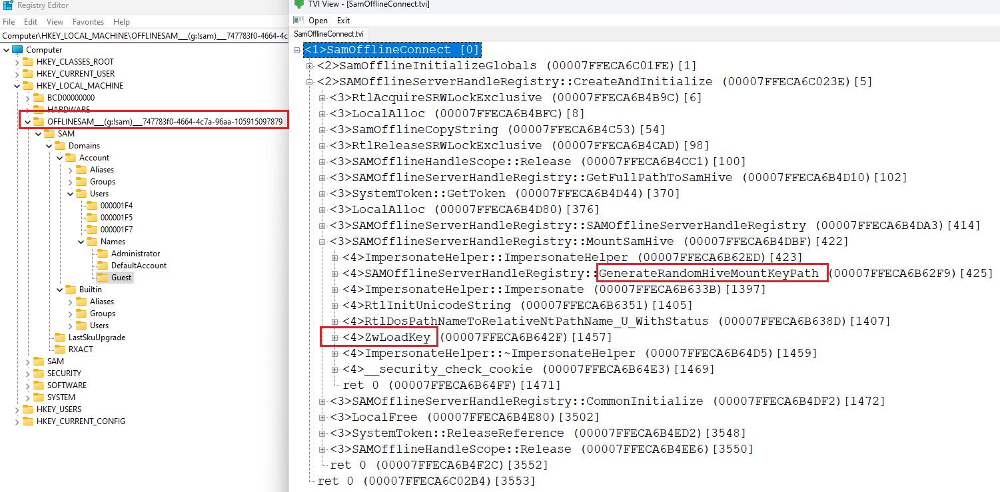

# OFFLINE-SAM

OFFLINESAM.DLL used for access SAM db file from another (not active) windows. 

SamOfflineConnect map SAM hive with random name in registry

OFFLINESAM tool for create import library (in LIB)
DEMO - demo usage
 
